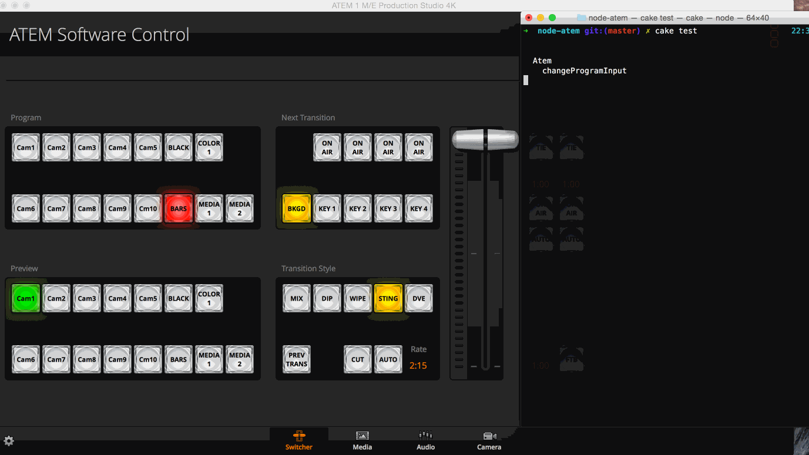

node-applest-atem [](https://www.npmjs.com/package/applest-atem) [](https://david-dm.org/applest/node-applest-atem) [](https://david-dm.org/applest/node-applest-atem#info=devDependencies)
========

A module to control Blackmagic Design ATEM Switchers.

## Installation

Install this module using npm.
*Note: this module name is `applest-atem`*
```sh
$ npm install applest-atem --save
```

## Recent changes

- Workaround from 0.1.x
Set `forceOldStyle` option to atem constructor if you upgrade this library from from 0.1.x.
`state` returns extract 1ME stats.

```javascript
var atem = new ATEM({
  forceOldStyle: true
});
```

## Usage

```javascript
var ATEM = require('applest-atem');

var atem = new ATEM();
atem.connect('192.168.1.220'); // Replace your ATEM switcher. address.

atem.on('connect', function() {
  atem.changeProgramInput(1); // ME1(0)
  atem.changePreviewInput(2); // ME1(0)
  atem.autoTransition(); // ME1(0)
  atem.changeProgramInput(3, 1); // ME2(1)
});

atem.on('stateChanged', function(err, state) {
  console.log(state); // catch the ATEM state.
});
console.log(atem.state); // or use this.
```

### Events

- `connect()`
It will called on receive first ping packet from ATEM.

- `disconnect()`
It will called on detect that it cannot communicate to ATEM in `RECONNECT_INTERVAL` seconds.

- `ping()`
It will called on receive ping packet from ATEM at an interval of one second.

- `stateChanged(err, state)`
It will called on receive state packet from ATEM.

### File Uploader Usage

```javascript
var ATEM = require('applest-atem');

var atem = new ATEM();
atem.connect('192.168.1.220');
atem.once('stateChanged', function (err, state) { // Delay few seconds from connecting.
  uploader = new ATEM.FileUploader(atem); // Pass the atem instance.
  uploader.uploadFromPNGFile('/Users/Sakura/Desktop/FHD.png'); // Pass a path of valid PNG file.
});
```

## Demo

See [live-controller](https://github.com/applest/live-controller).

## Debug

Set `ATEM_DEBUG=true` environment variable, you can see raw packet.
```sh
$ ATEM_DEBUG=true coffee debug.coffee
SEND <Buffer 10 14 53 ab 00 00 00 00 00 3a 00 00 01 00 00 00 00 00 00 00>
SEND <Buffer 80 0c 53 ab 00 00 00 00 00 03 00 00>
SEND <Buffer 80 0c 53 ab 00 00 00 00 00 03 00 00>
SEND <Buffer 80 0c 80 0f 00 01 00 00 00 41 00 00>
RECV _ver(12) <Buffer 00 0c 90 60 5f 76 65 72 00 02 00 10>...
```

## Test

This module run tests by mocha.
You can run the test only if you have ATEM switchers.
```sh
$ cake test
```

Use `ATEM_ADDR` or `ATEM_PORT` environment variables if you want to use specific ip address or port.
```sh
$ ATEM_ADDR=192.168.1.220 ATEM_PORT=9910 cake test
```

### Example


## Contributing

1. Fork it ( https://github.com/applest/node-applest-atem )
2. Create your feature branch (`git checkout -b my-new-feature`)
3. Add your feature and write a test
4. Commit your changes (`git commit -am 'Add some feature'`)
5. Push to the branch (`git push origin my-new-feature`)
6. Create new Pull Request

## License

The MIT License (MIT)

Copyright (c) 2015 Yusei Yamanaka (miyukki)

Permission is hereby granted, free of charge, to any person obtaining a copy
of this software and associated documentation files (the "Software"), to deal
in the Software without restriction, including without limitation the rights
to use, copy, modify, merge, publish, distribute, sublicense, and/or sell
copies of the Software, and to permit persons to whom the Software is
furnished to do so, subject to the following conditions:

The above copyright notice and this permission notice shall be included in
all copies or substantial portions of the Software.

THE SOFTWARE IS PROVIDED "AS IS", WITHOUT WARRANTY OF ANY KIND, EXPRESS OR
IMPLIED, INCLUDING BUT NOT LIMITED TO THE WARRANTIES OF MERCHANTABILITY,
FITNESS FOR A PARTICULAR PURPOSE AND NONINFRINGEMENT. IN NO EVENT SHALL THE
AUTHORS OR COPYRIGHT HOLDERS BE LIABLE FOR ANY CLAIM, DAMAGES OR OTHER
LIABILITY, WHETHER IN AN ACTION OF CONTRACT, TORT OR OTHERWISE, ARISING FROM,
OUT OF OR IN CONNECTION WITH THE SOFTWARE OR THE USE OR OTHER DEALINGS IN
THE SOFTWARE.
